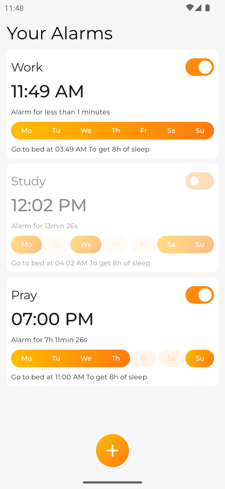
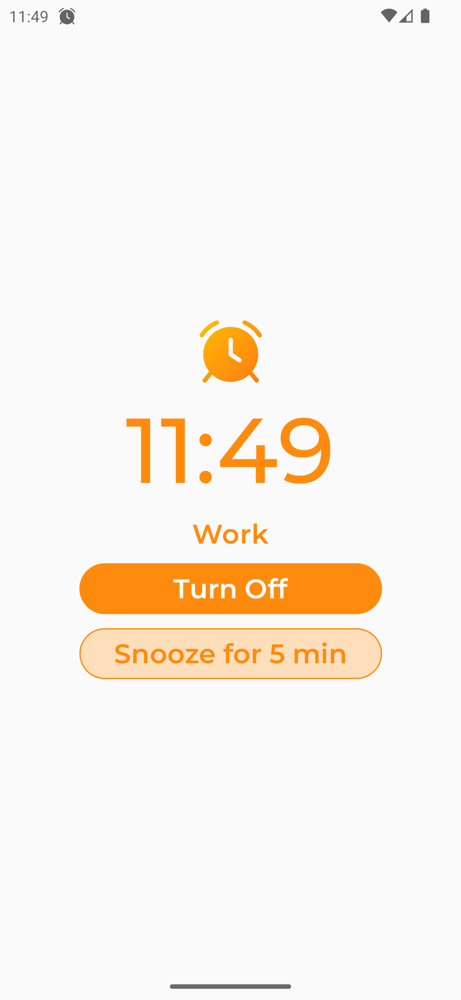
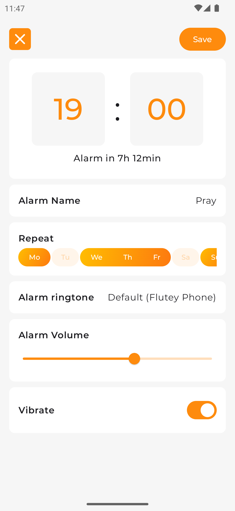
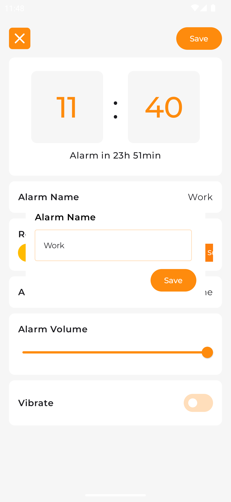
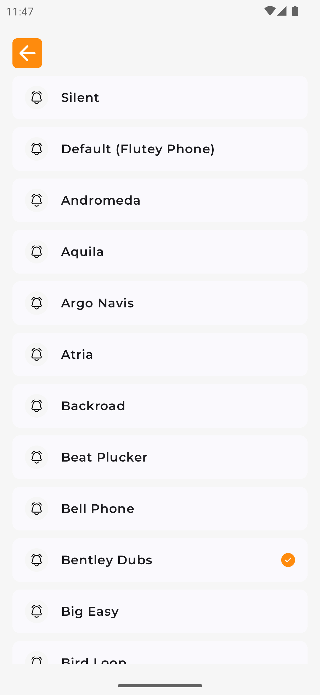

## Snoozeloo

An Alarm Clock Android app written in Kotlin using Jetpack Compose

## Screen Shots

<table style="padding:10px">
  <tr>
    <td></td>
    <td></td>
    <td></td>
  </tr>
  <tr>
    <td></td>
    <td></td>
    <td></td>
  </tr>
</table>

## Features
- Android architecture components (MVI)
- Declarative UI (with [Jetpack Compose](https://developer.android.com/jetpack/compose))
    - Compose Navigation (
      with [Koin Support](https://insert-koin.io/docs/quickstart/android-compose/) and Assisted
      Inject)
- Version Management (
  with [Version catalog](https://docs.gradle.org/current/userguide/platforms.html))
- Dependency injection (with [Koin](https://insert-koin.io/))
- Reactive programming (
  with [Kotlin Flows](https://kotlinlang.org/docs/reference/coroutines/flow.html))
- Edge To Edge Configuration

# Getting started

1. Download or Clone this repository extract and open folder on Android Studio
   ```sh
   https://github.com/galahseno/Snoozeloo.git
2. Run Projects